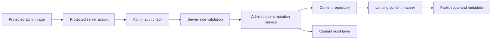

# Component Dependency

## Dependency Matrix

| From | Depends On | Relationship | Purpose |
|---|---|---|---|
| Public route | Landing Content Service | Runtime | Load page content for `/` |
| Metadata loader | Landing Content Service | Runtime | Load metadata text from DB-backed source |
| Landing Content Service | Content Repository Layer | Runtime | Fetch stored content records |
| Landing Content Service | Landing Content Mapper | Runtime | Build `LandingPageContent` |
| Admin content pages | Admin Content Query Service | Runtime | Load form-ready values |
| Admin content pages | Protected Content Mutation Actions | Runtime | Submit protected updates |
| Protected Content Mutation Actions | `getAdminAccessDecision` / auth helpers | Runtime | Enforce server-side authorization |
| Protected Content Mutation Actions | Admin Content Mutation Service | Runtime | Delegate validated persistence |
| Admin Content Mutation Service | Content Repository Layer | Runtime | Persist content updates |
| Admin Content Mutation Service | Content Audit Layer | Runtime | Persist before/after audit records |
| Seed and Initialization Layer | Content Repository Layer | Runtime | Initialize empty content store |
| Content Repository Layer | Content Schema Layer | Build/Runtime | Use Drizzle schema definitions |

## Communication Patterns
- **Public read flow**:
  - public route -> Landing Content Service -> repository + mapper -> typed landing page model
- **Admin read flow**:
  - protected admin page -> Admin Content Query Service -> repository + mapper -> page-specific form model
- **Admin write flow**:
  - protected admin page form -> server action -> auth check -> validation -> mutation service -> repository + audit -> revalidation
- **Seed flow**:
  - setup command or bootstrap path -> seed service -> repository -> initial content rows

## Data Flow Diagram

### Text Alternative
- Admin pages submit to protected server actions.
- Server actions re-check authorization and validate input.
- Valid updates go through the mutation service into the repository and audit layer.
- Public routes and metadata later read from the same repository through the mapper.

## Coupling Guidance
- Keep page components dependent on query and mutation services, not direct SQL or Drizzle calls.
- Keep the mapper independent from Next.js routing concerns.
- Keep authorization logic in the existing auth helper area rather than duplicating it inside components.
- Keep audit recording as a separate concern invoked by the mutation service.
