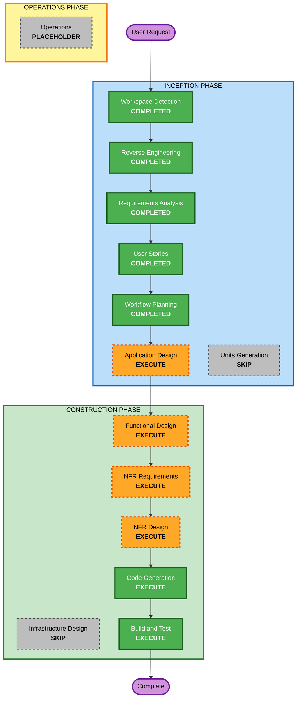

# Execution Plan

## Detailed Analysis Summary

### Transformation Scope (Brownfield Only)
- **Transformation Type**: Single-application architectural enhancement
- **Primary Changes**:
  - Add SQLite and Drizzle ORM as a persistence layer
  - Replace static landing-page text loading with database-backed content loading
  - Add protected admin content-management routes and save workflows
  - Extend tests and setup scripts for migrations and seed content
- **Related Components**:
  - Public route and metadata loader
  - Admin protected routes and navigation
  - New database schema, query layer, migrations, and seed logic
  - Existing auth and logging helpers
  - Existing landing-page and admin tests

### Change Impact Assessment
- **User-facing changes**: Yes. Public visitors will see content served from the database, and admins will gain new content-management workflows inside the portal.
- **Structural changes**: Yes. The application gains a new persistence layer and replaces a static content source with a mapped runtime content source.
- **Data model changes**: Yes. New SQLite schema, migrations, and seeded content are required.
- **API changes**: Yes. Internal server-side update handlers or server actions will be introduced for protected content writes.
- **NFR impact**: Yes. Security, validation, auditability, reliability, and maintainability are all directly affected.

### Component Relationships (Brownfield Only)
- **Primary Component**: `src/web`
- **Infrastructure Components**: None in-repo
- **Shared Components**:
  - `src/web/lib/auth/*`
  - `src/web/lib/site/*`
  - `src/web/components/landing/*`
  - `src/web/components/admin/*`
  - `src/web/types/*`
- **Dependent Components**:
  - Public route and metadata generation
  - Admin shell navigation and protected route tree
  - Tests under `src/web/tests`
- **Supporting Components**:
  - npm package and lockfile
  - environment configuration
  - build and test instructions

### Related Component Change Map
- **Public route and metadata**
  - **Change Type**: Major
  - **Change Reason**: Must load mapped DB content instead of static module data
  - **Change Priority**: Critical
- **Admin route tree and navigation**
  - **Change Type**: Major
  - **Change Reason**: Must expose grouped content page plus dedicated opening-hours and featured-taste pages
  - **Change Priority**: Critical
- **Database and content layer**
  - **Change Type**: Major
  - **Change Reason**: New schema, migrations, seed logic, data mappers, and update operations
  - **Change Priority**: Critical
- **Auth and logging helpers**
  - **Change Type**: Minor
  - **Change Reason**: Reuse authorization checks and extend structured logging/audit support for content updates
  - **Change Priority**: Important
- **Tests**
  - **Change Type**: Major
  - **Change Reason**: Must cover DB-backed rendering and admin content workflows
  - **Change Priority**: Critical

### Risk Assessment
- **Risk Level**: Medium
- **Rollback Complexity**: Moderate
- **Testing Complexity**: Moderate
- **Why**:
  - The change stays within one application package, which limits blast radius.
  - It introduces a new persistence layer and changes the runtime source of public content.
  - It also adds privileged write paths, so validation and authorization need careful coverage.

## Module Update Strategy
- **Update Approach**: Sequential
- **Critical Path**:
  - Define database/content model
  - Introduce read mapping for public rendering
  - Add protected admin write workflows
  - Add tests and build/test instructions
- **Coordination Points**:
  - Shared `LandingPageContent` typing
  - Metadata generation path
  - Admin authorization checks
  - Seed-data compatibility with current landing-page copy
- **Testing Checkpoints**:
  - After DB schema and mapper are in place
  - After admin routes and save handlers are added
  - After public rendering is switched to DB-backed content

## Workflow Visualization

### Text Alternative
- Completed inception stages: Workspace Detection, Reverse Engineering, Requirements Analysis, User Stories, Workflow Planning
- Next inception stage to execute: Application Design
- Skipped inception stage: Units Generation
- Construction stages to execute: Functional Design, NFR Requirements, NFR Design, Code Generation, Build and Test
- Skipped construction stage: Infrastructure Design
- Operations remains a placeholder and is not part of this implementation path

## Phases to Execute

### INCEPTION PHASE
- [x] Workspace Detection (COMPLETED)
- [x] Reverse Engineering (COMPLETED)
- [x] Requirements Analysis (COMPLETED)
- [x] User Stories (COMPLETED)
- [x] Workflow Planning (COMPLETED)
- [ ] Application Design - EXECUTE
  - **Rationale**: New database/content modules, new protected admin routes, and mapper/service boundaries need a concise design pass.
- [ ] Units Generation - SKIP
  - **Rationale**: This is still one coherent feature in a single app package, so a formal unit breakdown would add overhead without unlocking safer parallel work.

### CONSTRUCTION PHASE
- [ ] Functional Design - EXECUTE
  - **Rationale**: The content schema, field grouping, validation rules, and mapping logic need explicit design.
- [ ] NFR Requirements - EXECUTE
  - **Rationale**: Security baseline enforcement and reliability requirements materially affect the implementation.
- [ ] NFR Design - EXECUTE
  - **Rationale**: The approved NFR requirements need concrete design choices around validation, auditability, and failure handling.
- [ ] Infrastructure Design - SKIP
  - **Rationale**: No in-repo infrastructure or deployment-topology changes are requested in this feature.
- [ ] Code Generation - EXECUTE
  - **Rationale**: Implementation planning and generation are required.
- [ ] Build and Test - EXECUTE
  - **Rationale**: Build and test instructions must cover the new persistence layer, admin workflows, and updated public rendering.

## Recommended Implementation Sequence
1. Define the content schema and the mapping from stored values to `LandingPageContent`.
2. Design the protected admin route structure and page responsibilities.
3. Design validation, auditability, and failure-handling requirements.
4. Implement database setup, migrations, and seed content.
5. Implement public content loading and metadata integration.
6. Implement admin content pages and write flows.
7. Update tests, then create build-and-test instructions.

## Security Extension Compliance Summary
- `Security Baseline`: Compliant for Workflow Planning.
- `SECURITY-01`: Compliant. The plan treats SQLite as server-side storage and carries encrypted-hosting expectations forward.
- `SECURITY-02`: N/A. No network intermediary is being introduced or redesigned.
- `SECURITY-03`: Compliant. Logging and auditability remain in scope for later execution stages.
- `SECURITY-04`: Compliant. Existing security headers are preserved and infrastructure design is skipped only because no new HTML-serving edge layer is added.
- `SECURITY-05`: Compliant. Validation and parameterized persistence are explicit execution concerns.
- `SECURITY-06`: N/A. No IAM policy work exists in this repository scope.
- `SECURITY-07`: N/A. No network configuration changes are planned.
- `SECURITY-08`: Compliant. Protected admin routes and server-side authorization are central to the plan.
- `SECURITY-09`: Compliant. Controlled error handling remains part of later design work.
- `SECURITY-10`: Compliant. Dependency and build/test impacts are explicitly included.
- `SECURITY-11`: Compliant. The plan preserves layered security controls and existing rate limiting.
- `SECURITY-12`: Compliant. Existing Auth.js session and provider controls remain the authentication foundation.
- `SECURITY-13`: Compliant. Auditability is explicitly included in the execution path.
- `SECURITY-14`: N/A. Alerting and retention are outside the current repository feature scope.
