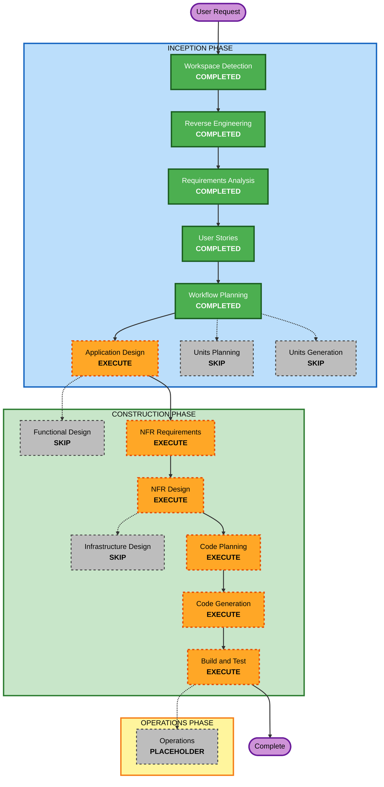

# Execution Plan

## Detailed Analysis Summary

### Transformation Scope (Brownfield Only)
- **Transformation Type**: Single-application architectural extension
- **Primary Changes**: Add a protected `/admin` area with Auth.js authentication, Microsoft personal-account sign-in, allowlist authorization, denial routing, and a lightweight dashboard shell
- **Related Components**:
  - App Router entrypoints and layouts in `src/web/app`
  - Auth and protected-route logic
  - Environment-backed configuration for secrets and allowlist entries
  - Admin UI shell components and supporting styles
  - Tests for protected access outcomes and admin-shell rendering

### Change Impact Assessment
- **User-facing changes**: Yes. New admin users and denied users will have distinct protected-route flows and UI outcomes.
- **Structural changes**: Yes. The application grows from a public landing page into a mixed public/protected app with authentication and authorization boundaries.
- **Data model changes**: No persistent schema changes are required in the first version.
- **API changes**: Yes. The feature introduces authentication endpoints and auth-related route handling inside the existing Next.js app.
- **NFR impact**: Yes. Security, auth correctness, maintainability, and brownfield-safe integration are all important.

### Component Relationships (Brownfield Only)
- **Primary Component**: `src/web` Next.js application
- **Infrastructure Components**: None as separate IaC packages; configuration and provider credentials remain app-level concerns
- **Shared Components**: Existing content, site config, and shared UI primitives may be reused selectively
- **Dependent Components**: Public landing-page routes must continue to work unchanged
- **Supporting Components**: Test suite, Docker build, environment configuration, security headers, request-throttling proxy

For each related component:
- **App Router / auth entrypoints**: Major change, because protected routing and auth flow are core to the feature
- **Admin shell components**: Major change, because the dashboard foundation is a new UI surface
- **Configuration and secrets**: Important, because provider setup and allowlist logic depend on correct env-backed configuration
- **Existing public site**: Important, because the change must not regress current public behavior
- **Tests**: Critical, because auth and denial flows are sensitive to regression

### Risk Assessment
- **Risk Level**: High
- **Rollback Complexity**: Moderate
- **Testing Complexity**: Complex

## Module Update Strategy
- **Update Approach**: Sequential
- **Critical Path**: Auth configuration and protected-route design block the admin layout implementation
- **Coordination Points**: Auth.js setup, Microsoft provider restrictions, allowlist logic, protected layout boundaries, and access-denied routing
- **Testing Checkpoints**: Validate public landing-page stability, admin sign-in routing, denial behavior, and dashboard-shell rendering before Build and Test completion

## Workflow Visualization

### Text Alternative
- Inception completed so far: Workspace Detection, Reverse Engineering, Requirements Analysis, User Stories, Workflow Planning
- Inception still to execute: Application Design
- Inception skipped: Units Planning and Units Generation
- Construction to execute: NFR Requirements, NFR Design, Code Planning, Code Generation, Build and Test
- Construction skipped: Functional Design and Infrastructure Design
- Operations remains a placeholder and is not part of current delivery

## Phases to Execute

### INCEPTION PHASE
- [x] Workspace Detection (COMPLETED)
- [x] Reverse Engineering (COMPLETED)
- [x] Requirements Elaboration (COMPLETED)
- [x] User Stories (COMPLETED)
- [x] Execution Plan (IN PROGRESS)
- [ ] Application Design - EXECUTE
  - **Rationale**: New auth boundaries, admin shell components, and protected-layout relationships need a fresh high-level design inside the existing app.
- [ ] Units Planning - SKIP
  - **Rationale**: The first admin slice remains a single coherent feature within one Next.js app rather than a multi-unit decomposition.
- [ ] Units Generation - SKIP
  - **Rationale**: Auth, denial handling, and dashboard shell are tightly coupled enough that splitting them into formal units would add overhead without improving execution.

### CONSTRUCTION PHASE
- [ ] Functional Design - SKIP
  - **Rationale**: The feature does not introduce complex domain rules, persistent schemas, or algorithmic logic that justify a separate functional-design stage.
- [ ] NFR Requirements - EXECUTE
  - **Rationale**: Authentication, authorization, session handling, brownfield safety, and maintainability create meaningful non-functional requirements.
- [ ] NFR Design - EXECUTE
  - **Rationale**: The selected NFRs need concrete design patterns for route protection, session handling, allowlist checks, and secure user-state transitions.
- [ ] Infrastructure Design - SKIP
  - **Rationale**: The first version adds provider credentials and env-backed config, but it does not introduce new infrastructure topology or deployment architecture beyond the current app deployment model.
- [ ] Code Planning - EXECUTE (ALWAYS)
  - **Rationale**: A code-generation plan is required before implementing the admin portal slice.
- [ ] Code Generation - EXECUTE (ALWAYS)
  - **Rationale**: The protected portal, auth setup, and dashboard shell must be implemented.
- [ ] Build and Test - EXECUTE (ALWAYS)
  - **Rationale**: The new auth-sensitive feature needs explicit verification instructions and build/test coverage.

### OPERATIONS PHASE
- [ ] Operations - PLACEHOLDER
  - **Rationale**: Deployment and monitoring workflows remain out of scope for this delivery.

## Estimated Timeline
- **Total Active Remaining Stages**: 5
- **Estimated Duration**: Medium single-track implementation effort

## Success Criteria
- **Primary Goal**: Deliver the first secure `/admin` portal slice inside the existing Bas IJs & Zo site
- **Key Deliverables**:
  - Auth.js integration with Microsoft personal-account sign-in
  - Config-backed allowlist authorization
  - Dedicated access-denied page
  - Lightweight branded admin dashboard shell
  - Brownfield-safe implementation with updated verification artifacts
- **Quality Gates**:
  - User approval at required stage boundaries
  - Public landing-page behavior remains intact
  - Protected admin routes enforce server-side auth and authorization
  - Secrets and allowlist handling remain environment-backed and non-hardcoded
  - Lint, test, and build workflows continue to pass
