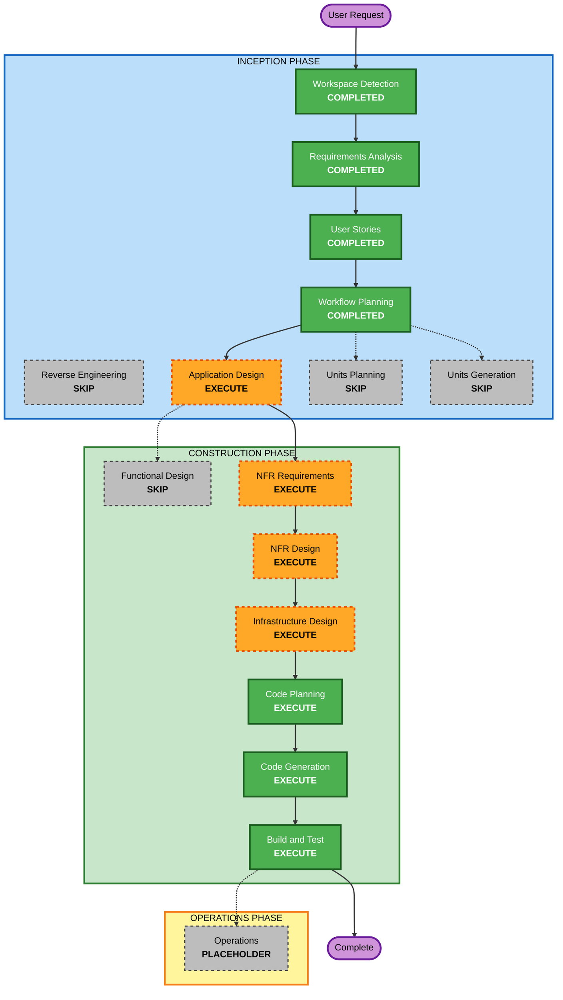

# Execution Plan

## Detailed Analysis Summary

### Change Impact Assessment
- **User-facing changes**: Yes. This is a customer-facing landing page where information hierarchy, trust, and visual tone are core to success.
- **Structural changes**: Yes. A new Next.js application, Tailwind styling system, modular page-section structure, and Docker packaging will be introduced from scratch.
- **Data model changes**: No. The first version does not require persistent data models or schemas.
- **API changes**: No. The first version does not define backend APIs or integration contracts.
- **NFR impact**: Yes. Mobile friendliness, secure public-site defaults, branding quality, responsiveness, maintainability, and containerized delivery are all important.

### Risk Assessment
- **Risk Level**: Medium
- **Rollback Complexity**: Easy
- **Testing Complexity**: Moderate

### Delivery Shape
- **Project Shape**: Single greenfield web application
- **Primary Deliverable**: A production-ready landing page with supporting Dockerized deployment setup
- **Implementation Model**: Single-unit delivery with modular UI sections

## Workflow Visualization

### Text Alternative
- Inception completed so far: Workspace Detection, Requirements Analysis, User Stories, Workflow Planning
- Inception still to execute: Application Design
- Inception skipped: Reverse Engineering, Units Planning, Units Generation
- Construction to execute: NFR Requirements, NFR Design, Infrastructure Design, Code Planning, Code Generation, Build and Test
- Construction skipped: Functional Design
- Operations remains a placeholder and is not part of current delivery

## Phases to Execute

### INCEPTION PHASE
- [x] Workspace Detection (COMPLETED)
- [x] Reverse Engineering (SKIPPED)
- [x] Requirements Elaboration (COMPLETED)
- [x] User Stories (COMPLETED)
- [x] Execution Plan (IN PROGRESS)
- [ ] Application Design - EXECUTE
  - **Rationale**: The app will be built from scratch and benefits from a compact high-level design for page sections, shared UI responsibilities, and branding/component boundaries.
- [ ] Units Planning - SKIP
  - **Rationale**: The work is a single application unit with no meaningful multi-unit decomposition.
- [ ] Units Generation - SKIP
  - **Rationale**: There is no need to map stories across multiple services or modules at planning level.

### CONSTRUCTION PHASE
- [ ] Functional Design - SKIP
  - **Rationale**: The request is UI-heavy and does not introduce complex business logic, schemas, or algorithms that justify a separate functional-design stage.
- [ ] NFR Requirements - EXECUTE
  - **Rationale**: Security, responsiveness, maintainability, production readiness, and Docker delivery are meaningful non-functional concerns.
- [ ] NFR Design - EXECUTE
  - **Rationale**: The selected NFRs need concrete implementation patterns such as security headers, mobile-first layout discipline, and container-oriented delivery decisions.
- [ ] Infrastructure Design - EXECUTE
  - **Rationale**: Dockerized hosting introduces a lightweight deployment architecture that should be defined before code generation.
- [ ] Code Planning - EXECUTE (ALWAYS)
  - **Rationale**: A code-generation plan is required before implementation.
- [ ] Code Generation - EXECUTE (ALWAYS)
  - **Rationale**: The application and container setup need to be implemented.
- [ ] Build and Test - EXECUTE (ALWAYS)
  - **Rationale**: Build, verification, and delivery instructions are required for a production-ready result.

### OPERATIONS PHASE
- [ ] Operations - PLACEHOLDER
  - **Rationale**: Future deployment and monitoring workflows are out of scope for this delivery.

## Estimated Timeline
- **Total Active Remaining Stages**: 6
- **Estimated Duration**: Short-to-medium single-track implementation effort

## Success Criteria
- **Primary Goal**: Deliver a branded, mobile-friendly, production-ready landing page for Bas IJs & Zo with Dockerized deployment support
- **Key Deliverables**:
  - Next.js application scaffold with TypeScript and Tailwind CSS
  - High-quality landing page UI matching the approved direction
  - Security-conscious public-site defaults
  - Production-oriented Docker setup
  - Build and test instructions
- **Quality Gates**:
  - User approval at required stage boundaries
  - Mobile-friendly UX preserved throughout
  - Branding remains centered on black and orange
  - Placeholder content remains realistic and easy to replace
  - Container build path remains production-oriented and maintainable
