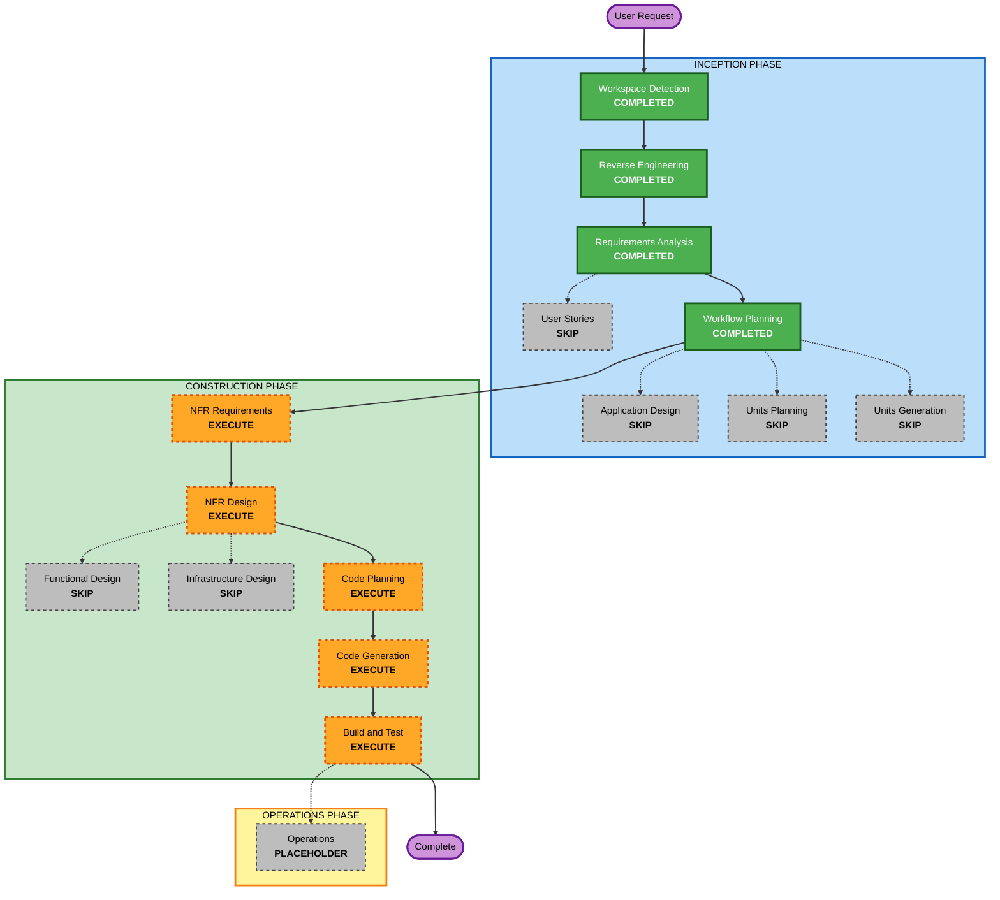

# Execution Plan

## Detailed Analysis Summary

### Transformation Scope (Brownfield Only)
- **Transformation Type**: Single-application auth-observability enhancement
- **Primary Changes**: Add structured authentication diagnostics, separate unexpected auth failures from access-denied outcomes, and keep the current `admin-portal` sign-in and protected-route flow brownfield-safe
- **Related Components**:
  - Auth configuration and shared auth constants in `src/web/lib/auth`
  - Auth route handling in `src/web/app/api/auth/[...nextauth]/route.ts`
  - Protected-route access evaluation in `src/web/lib/auth/admin-access.ts`
  - Admin sign-in and error surfaces in `src/web/app/admin` and `src/web/components/admin`
  - Admin-portal tests in `src/web/tests/admin-portal`

### Change Impact Assessment
- **User-facing changes**: Yes. Unexpected auth failures will gain a dedicated non-sensitive error experience instead of looking identical to authorization denial.
- **Structural changes**: No major architectural transformation. The work extends existing auth boundaries and admin routes inside the same Next.js app.
- **Data model changes**: No persistent schema or data-store changes.
- **API changes**: No new public APIs. Internal auth route behavior and auth error handling will change.
- **NFR impact**: Yes. Observability, security, maintainability, and brownfield reliability are central to this increment.

### Component Relationships (Brownfield Only)
- **Primary Component**: `src/web` Next.js application
- **Infrastructure Components**: None as separate IaC modules; logging remains app-level and deployment-platform collected
- **Shared Components**: Existing auth config, access-decision helpers, admin UI panels, shared styles, and test helpers
- **Dependent Components**: Protected admin pages, custom sign-in page, access-denied page, and deployment-platform logs
- **Supporting Components**: Existing lint, test, build, and Docker workflows

For each related component:
- **Auth config and route handling**: Major change, because this is where configuration and provider-failure diagnostics begin
- **Access-decision logic**: Major change, because unauthenticated, unauthorized, unavailable, and unexpected-failure outcomes must be separated
- **Admin sign-in and error UI**: Important, because the user needs a distinct auth-error experience
- **Tests**: Critical, because auth-sensitive behavior and logging-safe failure handling are easy to regress
- **Public landing page**: Important, because it must remain unaffected by the new auth diagnostics

### Risk Assessment
- **Risk Level**: Medium
- **Rollback Complexity**: Moderate
- **Testing Complexity**: Moderate

## Module Update Strategy
- **Update Approach**: Sequential
- **Critical Path**: Auth outcome classification and logging design must be settled before code planning and implementation
- **Coordination Points**: Auth.js configuration, protected-route redirects, sign-in error mapping, masked identifier logging, and test coverage for each auth outcome
- **Testing Checkpoints**: Validate sign-in behavior, access-denied behavior, dedicated auth-error behavior, and unchanged public-site rendering before Build and Test completion

## Workflow Visualization

### Text Alternative
- Inception completed for this increment: Workspace Detection, Reverse Engineering context loading, Requirements Analysis, Workflow Planning
- Inception skipped: User Stories, Application Design, Units Planning, Units Generation
- Construction to execute: NFR Requirements, NFR Design, Code Planning, Code Generation, Build and Test
- Construction skipped: Functional Design and Infrastructure Design
- Operations remains a placeholder and is not part of the current delivery scope

## Phases to Execute

### 🔵 INCEPTION PHASE
- [x] Workspace Detection (COMPLETED)
- [x] Reverse Engineering (COMPLETED)
- [x] Requirements Analysis (COMPLETED)
- [x] Workflow Planning (COMPLETED)
- [ ] User Stories - SKIP
  - **Rationale**: This increment is primarily an internal auth-observability enhancement with clear operator and maintainer outcomes; separate story generation would add overhead without clarifying the work materially.
- [ ] Application Design - SKIP
  - **Rationale**: The work stays within existing auth and admin component boundaries, so a dedicated high-level design stage is not necessary.
- [ ] Units Planning - SKIP
  - **Rationale**: The change remains a single coherent admin-portal increment inside one Next.js application.
- [ ] Units Generation - SKIP
  - **Rationale**: Splitting the work into formal units would add process overhead without reducing implementation risk.

### 🟢 CONSTRUCTION PHASE
- [ ] Functional Design - SKIP
  - **Rationale**: No new schema-heavy domain model or algorithmic business logic is being introduced.
- [ ] NFR Requirements - EXECUTE
  - **Rationale**: Security, observability, logging safety, and brownfield reliability must be explicitly confirmed for this auth-sensitive change.
- [ ] NFR Design - EXECUTE
  - **Rationale**: The selected NFRs need concrete design patterns for structured logging, masked identity handling, failure-path separation, and safe user-facing auth errors.
- [ ] Infrastructure Design - SKIP
  - **Rationale**: Logging stays within the existing deployment-platform collection model and does not add new infrastructure topology.
- [ ] Code Planning - EXECUTE (ALWAYS)
  - **Rationale**: A detailed implementation plan is required before changing auth flow code and tests.
- [ ] Code Generation - EXECUTE (ALWAYS)
  - **Rationale**: The auth diagnostics, error handling, and verification changes must be implemented.
- [ ] Build and Test - EXECUTE (ALWAYS)
  - **Rationale**: Auth-sensitive brownfield changes require explicit verification and refreshed test instructions.

### 🟡 OPERATIONS PHASE
- [ ] Operations - PLACEHOLDER
  - **Rationale**: Deployment and monitoring workflows remain outside the current AI-DLC implementation scope.

## Package Change Sequence (Brownfield Only)
- **Update Approach**: Single-package sequential update
- 1. `src/web/lib/auth`
  - Define structured auth logging helpers, masked-identifier handling, and refined access outcomes.
- 2. `src/web/app/api/auth/[...nextauth]/route.ts` and `src/web/app/admin/*`
  - Apply logging and distinct auth-error routing to the existing auth entrypoints and UI surfaces.
- 3. `src/web/tests/admin-portal`
  - Extend tests to cover the new auth-error and failure-classification behavior.

## Estimated Timeline
- **Total Active Remaining Stages**: 5
- **Estimated Duration**: Medium single-track implementation effort

## Success Criteria
- **Primary Goal**: Make the existing `admin-portal` authentication flow diagnosable in production without weakening security or breaking successful sign-in
- **Key Deliverables**:
  - Structured auth event logging to stdout or stderr
  - Masked user-identifier logging for relevant auth events
  - Distinct handling for unauthenticated, unauthorized, unavailable, and unexpected auth failures
  - Dedicated unexpected-auth-error user experience
  - Updated tests and build-and-test artifacts for the new auth-observability behavior
- **Quality Gates**:
  - User approval at required stage boundaries
  - No secrets, tokens, or full email addresses in logs
  - Existing public landing page remains intact
  - Allowlisted users can still sign in successfully
  - Lint, test, and build workflows continue to pass
