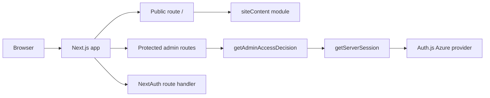
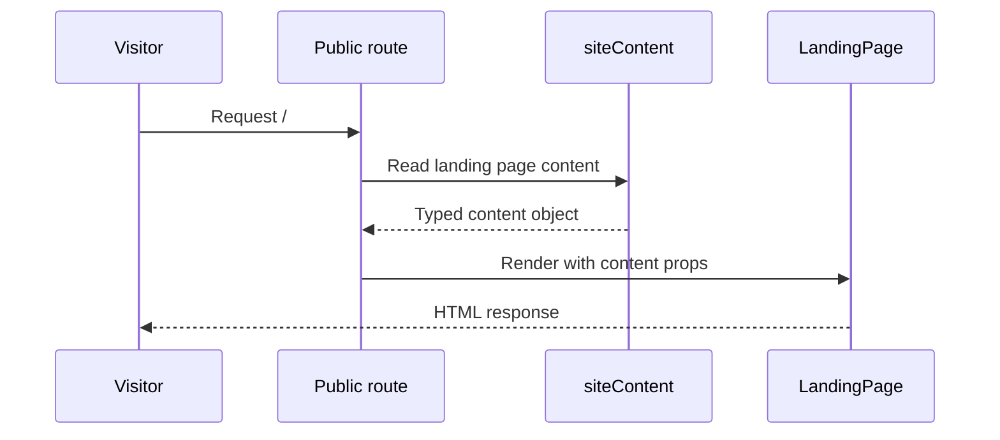

# System Architecture

## System Overview

The current system is a single Next.js 16 application located in `src/web`. It serves:
- a public landing page at `/`,
- an Auth.js-backed admin portal at `/admin`,
- a NextAuth route at `/api/auth/[...nextauth]`.

The public page is fully powered by a hardcoded `siteContent` object in `src/web/lib/content/site-content.ts`. The admin area already has a protected layout and navigation shell, but no content-management workflow yet.

## Architecture Diagram

### Text Alternative
- A single Next.js app serves both public and protected routes.
- The public route depends on a static content module.
- Protected admin routes depend on server-side auth access checks.
- Authentication is handled through the NextAuth route and Azure AD provider configuration.

## Component Descriptions

### Public route
- **Purpose**: Render the public landing page.
- **Responsibilities**: Load site content and pass it into presentational landing-page components.
- **Dependencies**: `LandingPage`, `siteContent`, metadata helpers.
- **Type**: Application route.

### Protected admin routes
- **Purpose**: Host the control portal for authenticated admins.
- **Responsibilities**: Check authorization, render admin shell, and display current dashboard content.
- **Dependencies**: `getAdminAccessDecision`, `AdminShell`, admin components.
- **Type**: Application route.

### Auth route
- **Purpose**: Handle NextAuth sign-in, callback, and session flows.
- **Responsibilities**: Delegate to NextAuth, redirect on auth errors, and log auth events.
- **Dependencies**: `authOptions`, logging helpers, Next.js request/response primitives.
- **Type**: Internal API route.

### Auth helpers
- **Purpose**: Encapsulate authentication configuration and authorization logic.
- **Responsibilities**: Validate env configuration, compute redirect paths, map session state, and enforce allowlisted access.
- **Dependencies**: NextAuth, environment variables, admin types.
- **Type**: Shared application logic.

### Landing-page content module
- **Purpose**: Provide all public text and content structures for the homepage.
- **Responsibilities**: Export a single typed `LandingPageContent` object used by rendering and metadata.
- **Dependencies**: `types/site.ts`.
- **Type**: Shared content/configuration module.

## Data Flow

### Text Alternative
- A visitor requests `/`.
- The route reads the static content object.
- That content is passed into the landing page component tree.
- The fully rendered page is returned to the browser.

## Integration Points
- **External APIs**: Microsoft identity endpoints through the Azure AD provider in NextAuth.
- **Databases**: None yet.
- **Third-party Services**: Google Maps links and social profile links are referenced as outbound URLs.

## Infrastructure Components
- **Deployment Model**: Standalone Next.js server build.
- **Networking**: Standard web app deployment, no custom infrastructure code present in the repository.
- **Security Layers**: Security headers via `next.config.ts` and simple in-memory rate limiting via `proxy.ts`.
