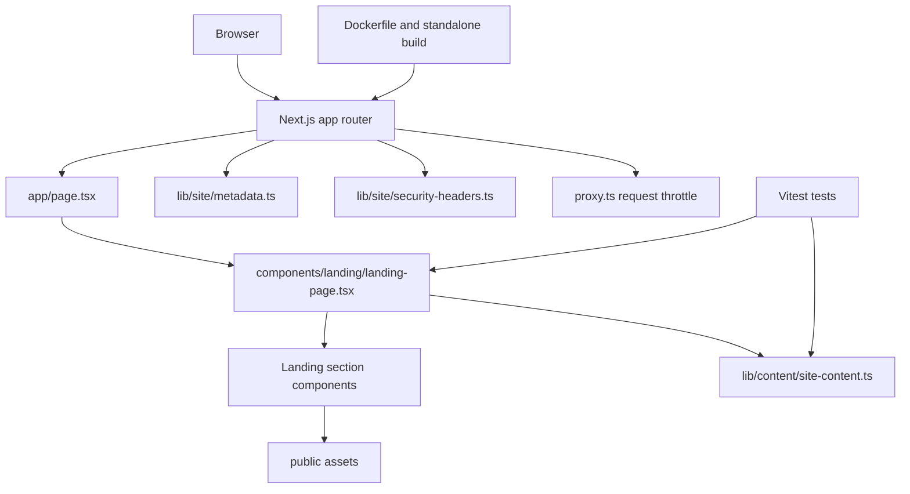
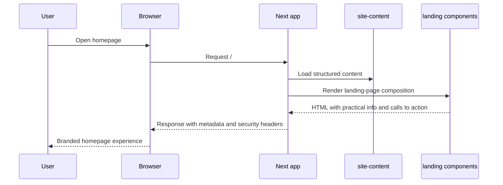

# System Architecture

## System Overview
The repository currently contains a single Next.js 16 application in `src/web`. The application serves one App Router page that composes a landing-page shell from a centralized content model, shared UI primitives, and section components. Supporting runtime concerns include metadata generation, HTTP security headers, a proxy-based request throttle for the public entrypoint, a small postbuild script for standalone packaging, Vitest-based UI checks, and a production-oriented Dockerfile.

## Architecture Diagram

### Text Alternative
- Browsers request the Next.js application.
- The homepage route renders a composite landing page.
- The landing page reads from centralized content and section components.
- Metadata, security headers, and request throttling are configured through dedicated runtime helpers.
- Docker packaging and tests wrap around the same application entrypoints.

## Component Descriptions

### `src/web/app`
- **Purpose**: Define the Next.js App Router entrypoint and global layout.
- **Responsibilities**: Serve the homepage, register fonts, import global styles, and expose page metadata.
- **Dependencies**: `components/landing`, `lib/site/metadata`, `lib/content/site-content`, `globals.css`
- **Type**: Application

### `src/web/components/landing`
- **Purpose**: Implement the main business sections of the homepage.
- **Responsibilities**: Compose the full page and render the branded information architecture.
- **Dependencies**: `components/ui`, `types/site`, Next.js image primitives, centralized content via props
- **Type**: Application

### `src/web/components/ui`
- **Purpose**: Provide reusable visual primitives for sections and action elements.
- **Responsibilities**: Encapsulate repeated patterns such as pills, cards, reveal wrappers, and review presentation.
- **Dependencies**: Tailwind-based styling and typed props from the feature layer
- **Type**: Shared

### `src/web/lib/content`
- **Purpose**: Store user-facing copy and business placeholders.
- **Responsibilities**: Provide typed content for metadata, hero messaging, practical info, featured products, reviews, and footer content.
- **Dependencies**: `types/site`
- **Type**: Shared

### `src/web/lib/site`
- **Purpose**: Hold runtime site concerns outside of visual sections.
- **Responsibilities**: Build metadata and generate required HTTP security headers.
- **Dependencies**: `lib/content/site-content`
- **Type**: Shared

### `src/web/tests`
- **Purpose**: Verify the homepage contract at component level.
- **Responsibilities**: Assert hero rendering, key business content visibility, and mobile menu behavior.
- **Dependencies**: Vitest, Testing Library, `components/landing/landing-page`, `lib/content/site-content`
- **Type**: Test

### `src/web/scripts`
- **Purpose**: Support production packaging.
- **Responsibilities**: Copy `public` and static assets into the Next.js standalone output after build.
- **Dependencies**: Node.js filesystem APIs and Next.js build output structure
- **Type**: Build Tooling

## Data Flow

### Text Alternative
1. A user opens the site homepage.
2. The Next.js route loads the centralized content object.
3. The page composition passes the content into section components.
4. The rendered response returns branded HTML plus response headers.

## Integration Points
- **External APIs**: None in the current implementation.
- **Databases**: None.
- **Third-party Services**:
  - Google Fonts via `next/font/google`
  - Outbound links to Google Maps, Instagram, Facebook, and the creator site

## Infrastructure Components
- **CDK Stacks**: None
- **Deployment Model**: Containerized Next.js standalone build packaged through `src/web/Dockerfile`
- **Networking**: No repository-managed infrastructure definitions are present
