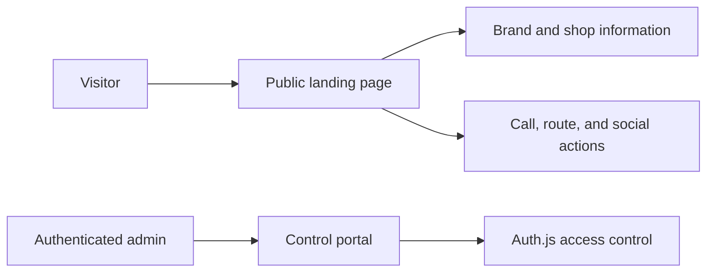

# Business Overview

## Business Context Diagram

### Text Alternative
- Visitors use the public landing page to read shop information and launch contact actions.
- Authenticated admins use the control portal, which is protected by Auth.js.
- The current system is content-driven but the content is still hardcoded in the application.

## Business Description
- **Business Description**: This application represents the public web presence of an artisanal ice cream shop and includes a separate secured admin area for internal control tasks.
- **Business Transactions**:
  - View the public landing page with brand, practical info, featured taste, reviews, and contact details.
  - Start direct visitor actions such as calling the shop or opening directions in Google Maps.
  - Sign in to the control portal through Microsoft-backed Auth.js authentication.
  - Authorize portal access against an allowlist of admin email addresses.
  - View the existing admin dashboard shell after successful authentication.
- **Business Dictionary**:
  - **Landing page**: The public homepage shown to unauthenticated visitors.
  - **Control portal**: The internal admin area under `/admin`.
  - **Admin allowlist**: The configured set of email addresses permitted to use the control portal.
  - **Site content**: The plain-text marketing and informational copy currently stored in code.

## Component Level Business Descriptions

### src/web
- **Purpose**: Single web application serving both the public site and the authenticated admin area.
- **Responsibilities**: Render the landing page, secure admin entry, and host supporting route handlers and tests.

### Public landing page components
- **Purpose**: Present store information in a clear, static marketing layout.
- **Responsibilities**: Render hero, practical information, featured taste, reviews, visit/contact details, and footer messaging.

### Admin portal components
- **Purpose**: Provide a secured internal workspace for authorized staff.
- **Responsibilities**: Authenticate users, show the admin shell, and host protected workflows.

### Authentication helpers
- **Purpose**: Centralize Auth.js configuration and authorization decisions.
- **Responsibilities**: Configure Microsoft login, validate sessions, enforce allowlist access, and log authentication events.
