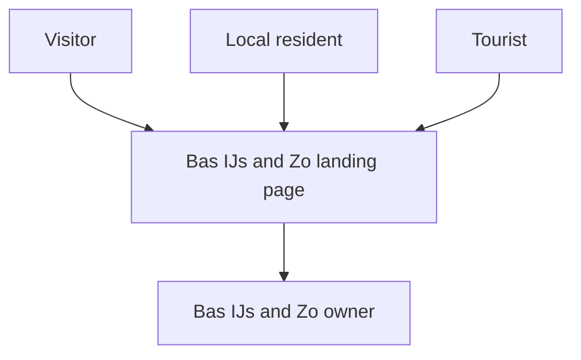

# Business Overview

## Business Context Diagram

### Text Alternative
- Visitors use the landing page to decide whether to visit, call, or navigate to the ice cream shop.
- The business owner controls the practical information and promotional copy presented on the page.

## Business Description
- **Business Description**: The system is a public-facing promotional and informational web experience for Bas IJs & Zo. It helps nearby residents, families, and occasional tourists quickly understand opening times, location, atmosphere, and featured products so they can decide to visit the shop.
- **Business Transactions**:
  - **Discover the shop**: A visitor lands on the homepage and gets an immediate branded first impression.
  - **Check practical availability**: A visitor confirms opening hours, address, and contact details.
  - **Evaluate current offer**: A visitor reviews the taste of the week and related product cues.
  - **Build trust**: A visitor reads the local story and review excerpts before deciding to visit.
  - **Take an action**: A visitor taps to call, open directions, or follow social channels.
- **Business Dictionary**:
  - **Taste of the week**: A short-lived featured flavor used as the promotional highlight on the page.
  - **Practical information**: Opening hours, address, phone number, and route guidance.
  - **Social proof**: Review snippets and rating summary used to reinforce trust.
  - **Centralized content**: A single content object that supplies nearly all rendered text and labels.

## Component Level Business Descriptions

### Next.js Web Application
- **Purpose**: Deliver the entire public landing-page experience.
- **Responsibilities**: Route requests to the homepage, render branded sections, expose metadata, and attach response headers.

### Content Module
- **Purpose**: Hold the editable business-facing text and labels that shape the page.
- **Responsibilities**: Store practical details, story copy, review placeholders, CTA labels, and metadata values in one place.

### Presentation Components
- **Purpose**: Translate structured content into a visually distinct landing page.
- **Responsibilities**: Render hero, practical information, featured taste, story, reviews, visit/contact, and footer sections.

### Delivery Tooling
- **Purpose**: Build, test, and package the site for deployment.
- **Responsibilities**: Run local development, create standalone production output, and package the app into a Docker image.
