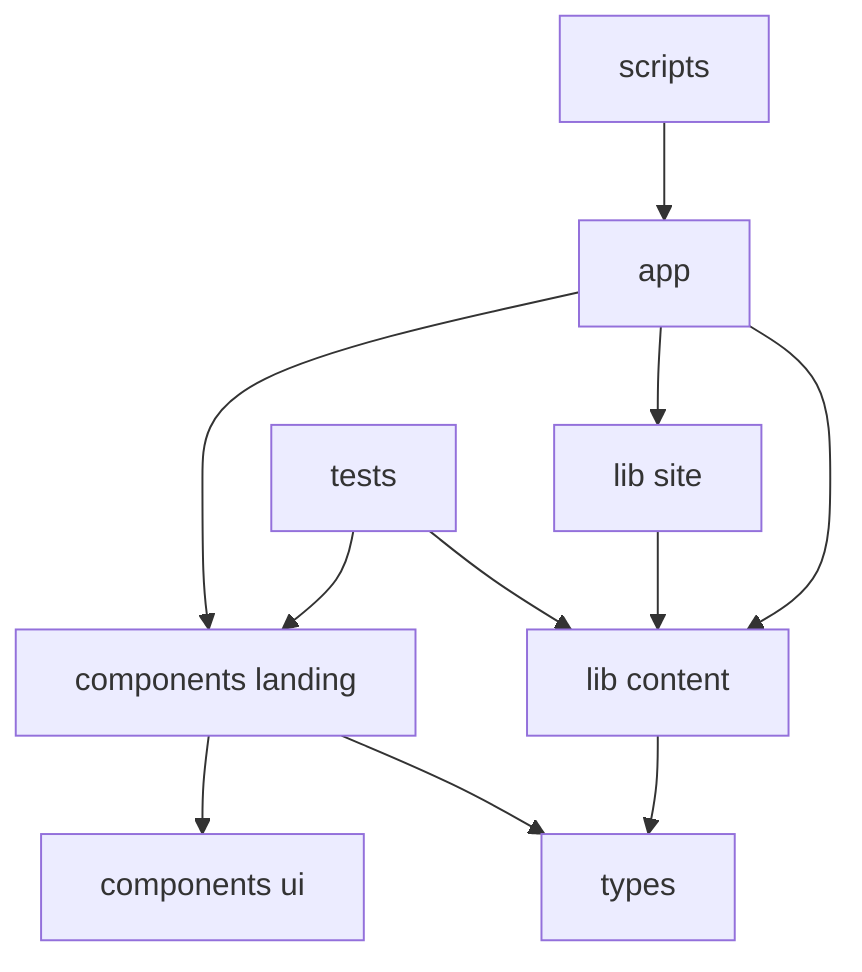

# Code Structure

## Build System
- **Type**: npm-based Next.js application
- **Configuration**:
  - `src/web/package.json` defines dev, build, start, lint, and test scripts
  - `src/web/package-lock.json` pins dependency resolution
  - `src/web/next.config.ts` configures standalone output and global response headers
  - `src/web/Dockerfile` packages the built standalone app for deployment

## Module Hierarchy

### Text Alternative
- App Router files depend on the landing-page composition and site-level helpers.
- Landing components depend on shared UI primitives and typed content models.
- Tests exercise the same landing-page composition with the centralized content object.

## Existing Files Inventory
- `src/web/app/layout.tsx` - Root HTML layout, font setup, and metadata registration
- `src/web/app/page.tsx` - Homepage entrypoint that renders the landing page
- `src/web/app/globals.css` - Global design tokens and application-wide styles
- `src/web/components/landing/landing-page.tsx` - Main page composition that wires all sections together
- `src/web/components/landing/header-bar.tsx` - Sticky header with desktop and mobile navigation states
- `src/web/components/landing/hero-section.tsx` - Hero and above-the-fold practical prompt
- `src/web/components/landing/practical-info-section.tsx` - Hours, contact, and route information
- `src/web/components/landing/taste-of-week-section.tsx` - Featured flavor storytelling block
- `src/web/components/landing/story-section.tsx` - Brand and village-story section
- `src/web/components/landing/reviews-section.tsx` - Social-proof and review summary section
- `src/web/components/landing/visit-contact-section.tsx` - Closing CTA area for visit/contact actions
- `src/web/components/landing/site-footer.tsx` - Footer and creator attribution
- `src/web/components/landing/social-rail.tsx` - Social-link display helper
- `src/web/components/ui/action-pill.tsx` - Styled CTA primitive
- `src/web/components/ui/info-card.tsx` - Reusable information card wrapper
- `src/web/components/ui/reveal.tsx` - Lightweight reveal/animation wrapper
- `src/web/components/ui/review-card.tsx` - Review presentation primitive
- `src/web/components/ui/section-shell.tsx` - Shared section layout framing
- `src/web/lib/content/site-content.ts` - Centralized typed content source for the page
- `src/web/lib/site/metadata.ts` - Metadata builder from content values
- `src/web/lib/site/security-headers.ts` - Security header generator for Next.js response config
- `src/web/proxy.ts` - Proxy-layer request throttling for the public entrypoint
- `src/web/types/site.ts` - TypeScript models for all content structures
- `src/web/tests/landing-page/page.test.tsx` - Component-level homepage regression checks
- `src/web/tests/setup.ts` - Test environment setup
- `src/web/scripts/prepare-standalone.mjs` - Postbuild asset-copy step for standalone output
- `src/web/package.json` - Project manifest and script definitions
- `src/web/package-lock.json` - Locked dependency graph
- `src/web/next.config.ts` - Next.js runtime/build configuration
- `src/web/vitest.config.ts` - Vitest runtime config and alias setup
- `src/web/eslint.config.mjs` - ESLint config using Next presets
- `src/web/postcss.config.mjs` - Tailwind/PostCSS integration
- `src/web/tsconfig.json` - TypeScript project settings
- `src/web/public/logo.png` - Logo asset
- `src/web/public/basijs1.jpg` - Hero/product photography
- `src/web/public/basijs2.jpg` - Supporting photography
- `src/web/public/basijs3.jpg` - Supporting photography
- `src/web/.dockerignore` - Docker build exclusions
- `src/web/.gitignore` - App-level git ignore rules

## Design Patterns

### Centralized Content Model
- **Location**: `src/web/lib/content/site-content.ts`, `src/web/types/site.ts`
- **Purpose**: Keep copy and practical information editable without touching component markup
- **Implementation**: A single typed object is passed into the top-level page composition

### Section Composition
- **Location**: `src/web/components/landing/landing-page.tsx`
- **Purpose**: Keep homepage structure explicit and easy to extend
- **Implementation**: The page is a thin coordinator that wires each section with targeted slices of content

### Shared Presentation Primitives
- **Location**: `src/web/components/ui`
- **Purpose**: Prevent duplicated styling patterns across sections
- **Implementation**: Cards, pills, and reveal wrappers are reused by multiple landing-page modules

### Standalone Build Packaging
- **Location**: `src/web/Dockerfile`, `src/web/scripts/prepare-standalone.mjs`
- **Purpose**: Produce a smaller deployable Next.js artifact
- **Implementation**: Next.js standalone output is post-processed so the runtime image contains the needed static and public assets

### Edge Entry Protection
- **Location**: `src/web/proxy.ts`
- **Purpose**: Apply lightweight abuse protection to the public route layer
- **Implementation**: An in-memory per-IP, per-path window limits repeated requests and returns HTTP 429 with `Retry-After`

## Critical Dependencies

### Next.js
- **Version**: 16.2.1
- **Usage**: Routing, metadata, image optimization, production build pipeline
- **Purpose**: Core application framework

### React
- **Version**: 19.2.4
- **Usage**: Component rendering and client interactivity
- **Purpose**: UI runtime

### Tailwind CSS
- **Version**: 4.2.2
- **Usage**: Utility-first styling through PostCSS
- **Purpose**: Design system implementation

### Vitest and Testing Library
- **Version**: 4.1.2 and 16.3.2
- **Usage**: Homepage rendering and interaction verification
- **Purpose**: Lightweight regression testing
