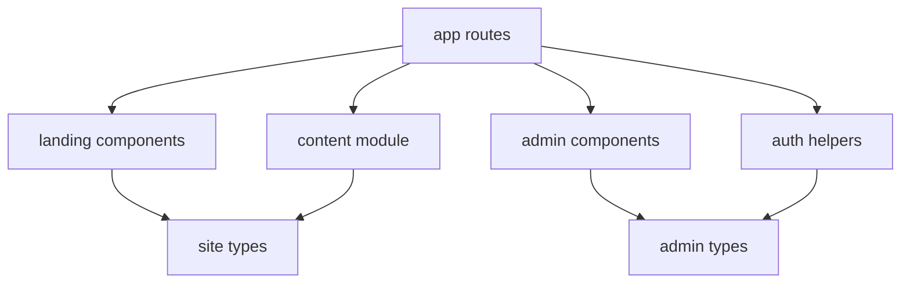

# Code Structure

## Build System
- **Type**: npm
- **Configuration**:
  - `src/web/package.json` defines dev, build, start, lint, and test scripts.
  - `src/web/tsconfig.json` configures TypeScript.
  - `src/web/next.config.ts` configures standalone output and response headers.
  - `src/web/vitest.config.ts` configures test execution.

## Module Hierarchy

### Text Alternative
- App routes depend on landing components, admin components, auth helpers, and the content module.
- Landing and content logic share the site content types.
- Admin shell and auth logic share admin types.

## Existing Files Inventory

### Route and app files
- `src/web/app/layout.tsx` - Root layout and metadata hookup.
- `src/web/app/page.tsx` - Public landing-page route.
- `src/web/app/admin/(protected)/layout.tsx` - Protected admin layout with access checks.
- `src/web/app/admin/(protected)/page.tsx` - Admin home page.
- `src/web/app/admin/sign-in/page.tsx` - Custom admin sign-in screen.
- `src/web/app/admin/access-denied/page.tsx` - Access denied screen.
- `src/web/app/admin/auth-error/page.tsx` - Auth error screen.
- `src/web/app/api/auth/[...nextauth]/route.ts` - NextAuth route handler.
- `src/web/proxy.ts` - Request rate-limiting proxy.

### Shared logic
- `src/web/lib/content/site-content.ts` - Hardcoded public landing-page content.
- `src/web/lib/site/metadata.ts` - Metadata derived from site content.
- `src/web/lib/site/security-headers.ts` - HTTP security header definitions.
- `src/web/lib/auth/config.ts` - Auth.js config and route constants.
- `src/web/lib/auth/admin-access.ts` - Authorization decision logic.
- `src/web/lib/auth/allowed-accounts.ts` - Allowlist parsing and matching.
- `src/web/lib/auth/logging.ts` - Auth-related logging helpers.
- `src/web/lib/auth/navigation.ts` - Admin navigation definition.
- `src/web/lib/auth/session.ts` - Session-to-view-model mapping.

### Components
- `src/web/components/landing/*` - Public homepage sections and assembly.
- `src/web/components/admin/*` - Admin shell, sidebar, and auth-related panels.
- `src/web/components/ui/*` - Shared UI primitives.
- `src/web/components/providers/auth-session-provider.tsx` - Client session provider wrapper.

### Types and tests
- `src/web/types/site.ts` - Landing page content types.
- `src/web/types/admin.ts` - Admin navigation and session view-model types.
- `src/web/tests/landing-page/page.test.tsx` - Landing page component tests.
- `src/web/tests/admin-portal/admin-portal.test.tsx` - Admin portal helper and component tests.
- `src/web/tests/setup.ts` - Testing setup.

## Design Patterns

### Server-side authorization gate
- **Location**: `src/web/app/admin/(protected)/layout.tsx`, `src/web/lib/auth/admin-access.ts`
- **Purpose**: Keep protected routing on the server and avoid rendering protected content before access is confirmed.
- **Implementation**: Admin routes call a cached async access-decision helper and redirect when unauthorized.

### Typed content object as a page model
- **Location**: `src/web/lib/content/site-content.ts`, `src/web/types/site.ts`
- **Purpose**: Centralize homepage content in a single typed structure.
- **Implementation**: A large static object is passed through the landing page component tree.

### Thin route, rich presentational components
- **Location**: `src/web/app/page.tsx`, `src/web/components/landing/*`
- **Purpose**: Keep route files simple and push rendering into reusable components.
- **Implementation**: Routes only load data and hand it to components.

## Critical Dependencies

### next
- **Version**: 16.2.1
- **Usage**: Routing, rendering, metadata, route handlers, and standalone output.
- **Purpose**: Core framework.

### react / react-dom
- **Version**: 19.2.4
- **Usage**: Component rendering and client interactions.
- **Purpose**: UI runtime.

### next-auth
- **Version**: ^4.24.13
- **Usage**: Microsoft sign-in, session handling, and admin authentication.
- **Purpose**: Auth.js integration for the control portal.
