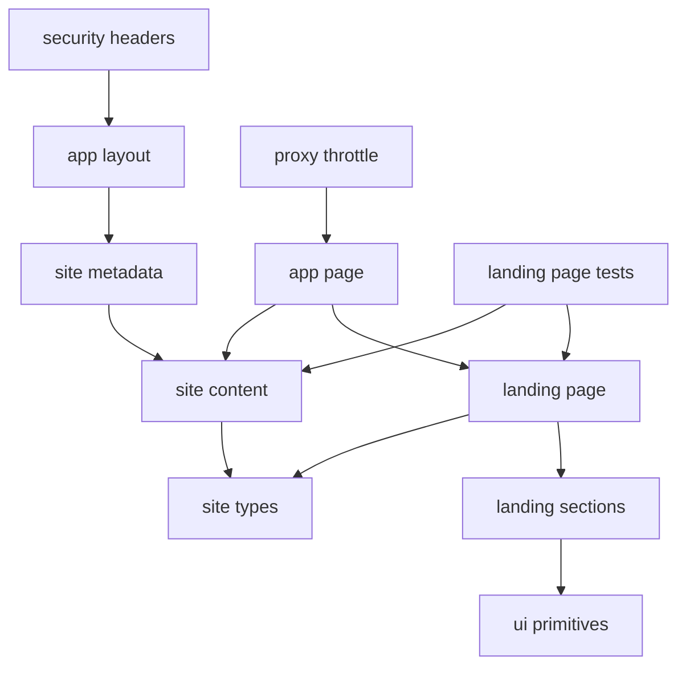

# Dependencies

## Internal Dependencies

### Text Alternative
- The homepage route depends on the landing-page composition and the centralized content object.
- Metadata depends on the same centralized content.
- Landing sections depend on shared UI primitives and typed models.
- Tests depend on the landing-page composition and content fixture.

### `app/page.tsx` depends on `components/landing/landing-page.tsx`
- **Type**: Runtime
- **Reason**: The route delegates visual composition to the landing-page component

### `app/page.tsx` depends on `lib/content/site-content.ts`
- **Type**: Runtime
- **Reason**: The route injects the centralized content payload into the page

### `app/layout.tsx` depends on `lib/site/metadata.ts`
- **Type**: Runtime
- **Reason**: The layout exposes typed metadata for the entire site

### `lib/site/metadata.ts` depends on `lib/content/site-content.ts`
- **Type**: Runtime
- **Reason**: Metadata values come from the centralized content source

### `proxy.ts` depends on Next server runtime
- **Type**: Runtime
- **Reason**: Request throttling executes before route rendering using `NextRequest` and `NextResponse`

### `components/landing/*` depends on `components/ui/*`
- **Type**: Runtime
- **Reason**: Shared visual primitives reduce duplication across sections

### `lib/content/site-content.ts` depends on `types/site.ts`
- **Type**: Compile
- **Reason**: The content object is checked against typed contracts

### `tests/landing-page/page.test.tsx` depends on landing and content modules
- **Type**: Test
- **Reason**: Tests render the same page composition and assert content-driven output

## External Dependencies

### `next`
- **Version**: 16.2.1
- **Purpose**: App framework, routing, metadata, image handling, standalone output
- **License**: MIT

### `react` and `react-dom`
- **Version**: 19.2.4
- **Purpose**: Core rendering runtime
- **License**: MIT

### `tailwindcss` and `@tailwindcss/postcss`
- **Version**: 4.2.2
- **Purpose**: Utility CSS and build integration
- **License**: MIT

### `eslint` and `eslint-config-next`
- **Version**: 9.39.4 and 16.2.1
- **Purpose**: Static linting and framework-specific lint rules
- **License**: MIT

### `vitest`, `@testing-library/react`, `@testing-library/jest-dom`, `jsdom`
- **Version**: 4.1.2, 16.3.2, 6.9.1, 29.0.1
- **Purpose**: Component testing stack
- **License**: MIT
