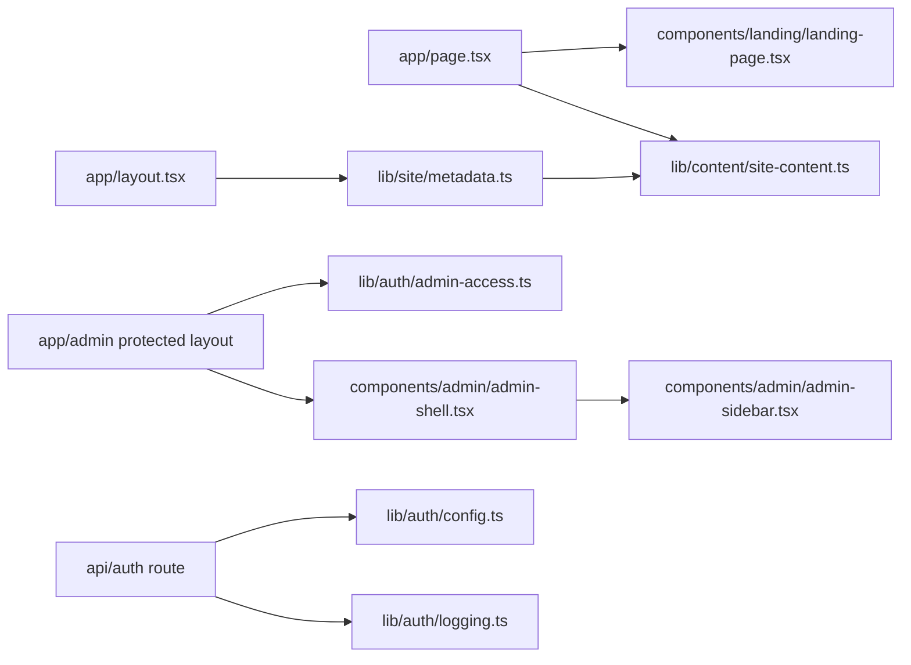

# Dependencies

## Internal Dependencies

### Text Alternative
- Public routes depend on the landing page component tree and the static content module.
- Root layout metadata also depends on the same content module.
- Admin routes depend on authorization helpers and the admin shell.
- Auth routes depend on auth configuration and logging helpers.

### Public route depends on landing page and content modules
- **Type**: Runtime
- **Reason**: Route rendering requires landing components and content data.

### Admin routes depend on auth helpers and admin UI
- **Type**: Runtime
- **Reason**: Protected rendering requires access checks and portal components.

## External Dependencies

### `next`
- **Version**: 16.2.1
- **Purpose**: App framework, routing, rendering
- **License**: MIT

### `react`
- **Version**: 19.2.4
- **Purpose**: UI rendering
- **License**: MIT

### `react-dom`
- **Version**: 19.2.4
- **Purpose**: DOM rendering
- **License**: MIT

### `next-auth`
- **Version**: ^4.24.13
- **Purpose**: Authentication and session management
- **License**: ISC

### `vitest`
- **Version**: 4.1.2
- **Purpose**: Test execution
- **License**: MIT
